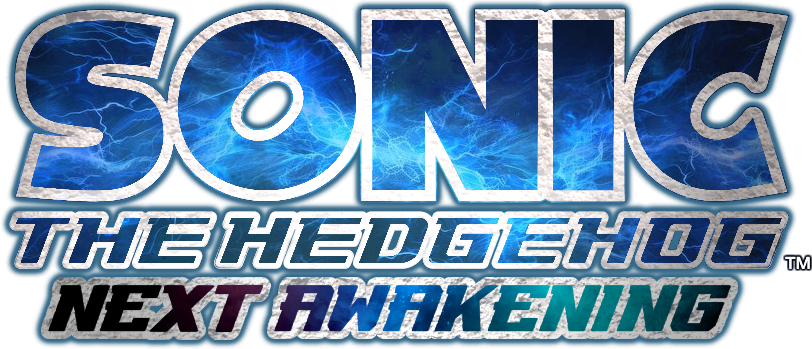

# SONIC THE HEDGEHOG NEXT AWAKENING
The github repository for (the Xbox 360 version of) Sonic '06: Next Awakening Mod.

Please check our [license](LICENSE) for usage information
## Documentation
- [Disclaimer](#disclaimer)
- [Downlaods](#downloads)
- [Todos](#todos)
- [Tools](#tools)

## Disclaimer
This repository does not contain any compressed arc files and all files in here are extracted and decompiled.
Please make sure that if you downloaded the mod to replace your patches.ini file with [the one in this repository](patches.ini).

## Downloads
- [Merge Xbox 360 Version](https://github.com/PixelBlitzBOI/NextAwakening-Mod_Source/tree/xenon)

## Todos
### Completed Todos
- Increased Sonic and Shadow's Lightdash radius to behave more like P06
- Increased Lightdash speed
- Increased Sonic's airdash speed
- Reduced Sonic and Shadow's airdash time
- Reduced Shadow's Chaos Combo timer for better acccess to homing spam
- Increased Tails' flight time at the cost of his speed
- Edited every Omega voiceline to sound better
- Retextured the 3 main hedgehogs to look more like their CGI Cutscene models
- Slightly decreased load times for some of Sonic's stages (WiP)

### WiP Todos
- Slightly decrease loading times for town missions, bosses, and stages for EVERY story
- Replace title screen logo
- Replace title screen background video
- Separate the audio from the title screen into a xma
- Make a branch for the Xbox 360 version (the mod itself not the source code)
- Make a branch for the PS3 version (the mod itself not the source code)

More todos will be made after we come up with more ideas!

## Tools
- [Sonic '06 Toolkit](https://github.com/GerbilSoft/Sonic-06-Toolkit) - Used for extracting arc files, and decompiling stuff.
- [Marathon](https://github.com/hyperbx/Marathon) - Used to repack arc files.
- [Kunai](https://github.com/NextinMono/kunai) Used to edit xncp files.

# Special thanks
- lillie-chan (title screen xmas)
